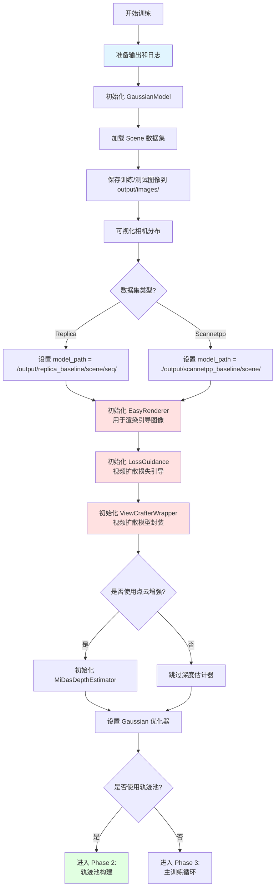
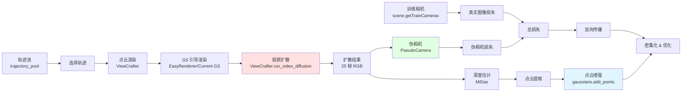
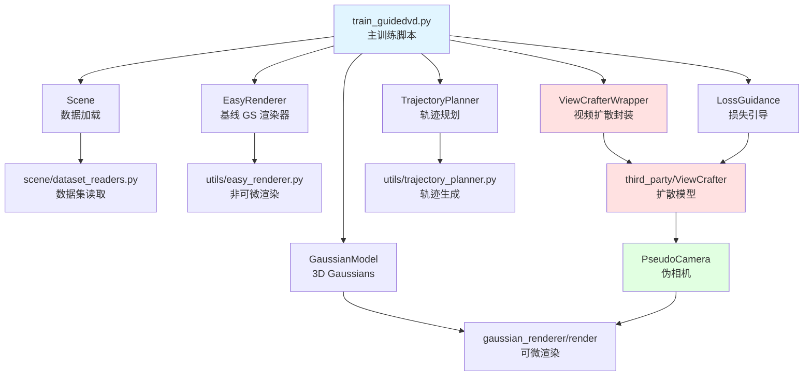
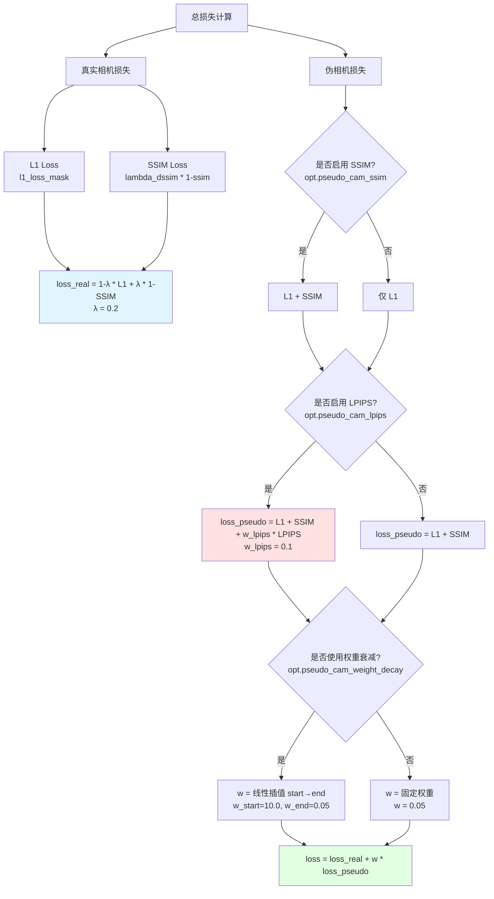

# GuidedVD Training Pipeline 完整流程图

## 总览架构

```
┌─────────────────────────────────────────────────────────────────────┐
│                     GuidedVD Training Pipeline                       │
│                                                                       │
│  Phase 1: Initialization → Phase 2: Trajectory Pool →               │
│  Phase 3: Main Training Loop (with Video Diffusion Guidance)        │
└─────────────────────────────────────────────────────────────────────┘
```

---

## Phase 1: 初始化阶段 (Iteration 0)



---

## Phase 2: 轨迹池构建 (Trajectory Pool Initialization)

```mermaid
graph TD
    A[开始轨迹池构建] --> B[初始化空字典 trajectory_pool]
    B --> C[遍历每个训练视角 train_idx]

    C --> D1[Scale 1: center_scale = original<br/>例如 1.0]
    C --> D2[Scale 2: center_scale = original/3<br/>例如 0.33]
    C --> D3[Scale 3: center_scale = original/10<br/>例如 0.1]

    D1 --> E1[生成候选位姿<br/>d_phi=(-30,-15,0,15,30)<br/>d_theta=(-30,-15,0,15,30)]
    D2 --> E2[生成候选位姿<br/>相同角度范围]
    D3 --> E3[生成候选位姿<br/>相同角度范围]

    E1 --> F1[使用 EasyRenderer<br/>渲染所有候选位姿]
    E2 --> F2[使用 EasyRenderer<br/>渲染所有候选位姿]
    E3 --> F3[使用 EasyRenderer<br/>渲染所有候选位姿]

    F1 --> G1[计算遮挡 mask<br/>alpha < 0.7 = 遮挡区域]
    F2 --> G2[计算遮挡 mask<br/>alpha < 0.7 = 遮挡区域]
    F3 --> G3[计算遮挡 mask<br/>alpha < 0.7 = 遮挡区域]

    G1 --> H1[选择 top-k=3 个<br/>遮挡区域最少的轨迹]
    G2 --> H2[选择 top-k=2 个<br/>遮挡区域最少的轨迹]
    G3 --> H3[选择 top-k=1 个<br/>遮挡区域最少的轨迹]

    H1 --> I1[插值生成 25 帧轨迹]
    H2 --> I2[插值生成 25 帧轨迹]
    H3 --> I3[插值生成 25 帧轨迹]

    I1 --> J[保存到 trajectory_pool]
    I2 --> J
    I3 --> J

    J --> K{所有训练视角处理完?}
    K -->|否| C
    K -->|是| L[创建 trajectory_pool_shuffle<br/>用于随机采样]

    L --> M[可选: 验证 TrajectoryPlanner 封装一致性]
    M --> N[进入 Phase 3:<br/>主训练循环]

    style D1 fill:#ffe1e1
    style D2 fill:#fff4e1
    style D3 fill:#e1ffe1
    style J fill:#e1e1ff
```

**轨迹池数据结构**：
```python
trajectory_pool = {
    0: [  # 训练视角 0
        [j_idx, c2w_traj_25frames, center_scale, scale_idx],  # Scale 1 轨迹 1
        [j_idx, c2w_traj_25frames, center_scale, scale_idx],  # Scale 1 轨迹 2
        [j_idx, c2w_traj_25frames, center_scale, scale_idx],  # Scale 1 轨迹 3
        [j_idx, c2w_traj_25frames, center_scale, scale_idx],  # Scale 2 轨迹 1
        [j_idx, c2w_traj_25frames, center_scale, scale_idx],  # Scale 2 轨迹 2
        [j_idx, c2w_traj_25frames, center_scale, scale_idx],  # Scale 3 轨迹 1
    ],
    1: [...],  # 训练视角 1
    ...
}
```

---

## Phase 3: 主训练循环 (Main Training Loop)

```mermaid
graph TD
    A[开始训练迭代] --> B{iteration % 500 == 0?}
    B -->|否| C[选择随机训练相机]
    B -->|是| B1[更新 SH 度数<br/>注释掉未使用]
    B1 --> C

    C --> D[渲染真实相机<br/>render viewpoint_cam]
    D --> E[计算真实相机损失<br/>L1 + SSIM]

    E --> F{是否使用伪相机?<br/>iteration % sample_pseudo_interval == 0<br/>且在 [start_sample_pseudo, end_sample_pseudo] 区间}

    F -->|是| G{选择伪相机池}
    F -->|否| M[loss = real_camera_loss]

    G -->|50%概率| H[从 pseudo_stack 采样]
    G -->|50%概率| I[从 pseudo_stack_alltime 采样]

    H --> J[渲染伪相机]
    I --> J

    J --> K[计算伪相机损失<br/>L1 + 可选SSIM + 可选LPIPS]
    K --> L[loss = real_loss + weight * pseudo_loss]

    L --> M
    M --> N[反向传播]

    N --> O{iteration < densify_until_iter?}
    O -->|是| P{是否使用了伪相机?}
    O -->|否| T

    P -->|是| Q[双流密集化<br/>真实+伪相机梯度]
    P -->|否| R[单流密集化<br/>仅真实相机梯度]

    Q --> S{iteration % densification_interval == 0?}
    R --> S
    S -->|是| S1[密集化和剪枝]
    S -->|否| T
    S1 --> T

    T[优化器更新]
    T --> U{iteration % opacity_reset_interval == 0?}
    U -->|是| V[重置不透明度]
    U -->|否| W
    V --> W

    W{iteration % guidance_vd_iter == 0<br/>且 iteration < end_sample_pseudo?}
    W -->|是| X[进入视频扩散生成阶段]
    W -->|否| Y{iteration < opt.iterations?}

    X --> Y
    Y -->|是| A
    Y -->|否| Z[训练完成]

    style D fill:#e1f5ff
    style J fill:#ffe1e1
    style Q fill:#e1ffe1
    style X fill:#ffe1ff
```

---

## Phase 3.1: 视频扩散生成阶段 (每隔 guidance_vd_iter 次迭代)

```mermaid
graph TD
    A[触发视频扩散] --> B{是否使用轨迹池?}

    B -->|是| C1[从 vd_generated_indices 随机选择<br/>which_train_view]
    B -->|否| C2[随机选择训练视角]

    C1 --> D1[从 trajectory_pool_shuffle 弹出轨迹<br/>j_idx, c2w_traj, center_scale, scale_idx]
    C2 --> D2[随机生成轨迹]

    D1 --> E[更新 vc_wrapper.vc_opts.center_scale]
    D2 --> E

    E --> F[ViewCrafter 预处理<br/>点云渲染生成条件图像]
    F --> G[遍历轨迹的 25 帧位姿]

    G --> H{使用训练中的 GS 还是基线 GS?}

    H -->|训练中 GS<br/>iteration >= guidance_with_training_gs_startiter| I1[使用当前 gaussians 渲染]
    H -->|基线 GS<br/>默认| I2[使用 EasyRenderer 渲染基线 GS]

    I1 --> J[收集 gs_render_results<br/>gs_render_alphas<br/>gs_render_depths]
    I2 --> J

    J --> K[生成遮挡 mask<br/>alpha < 0.9 = 遮挡区域]
    K --> L[保存引导图像和 mask 为视频<br/>gs_render.mp4, gs_render_alpha.mp4]

    L --> M[运行视频扩散模型<br/>vc_wrapper.run_video_diffusion]
    M --> N[传入引导信息:<br/>- guidance_images: gs_render_results<br/>- guidance_masks: 1 - gs_render_alphas<br/>- guidance_depths: gs_render_depths]

    N --> O[获得扩散结果<br/>diffusion_results (25, 3, H, W)]

    O --> P{是否从扩散结果提取点云?<br/>opt.append_pcd_from_video_diffusion}

    P -->|是| Q1[使用 MiDas 估计深度]
    P -->|否| R[跳过点云增强]

    Q1 --> Q2[对齐 MiDas 深度和 GS 深度<br/>scale, shift = get_scaleshift]
    Q2 --> Q3[转换为度量深度<br/>metric_depth]
    Q3 --> Q4[反投影到 3D 点云<br/>depth_to_point_cloud]
    Q4 --> Q5[过滤无效点<br/>NaN, Inf]
    Q5 --> Q6[添加点云到 Gaussians<br/>gaussians.add_points]
    Q6 --> R

    R --> S[创建伪相机列表<br/>pseudo_stack = empty list]
    S --> T[遍历扩散结果的 25 帧]
    T --> U[跳过第 0 帧<br/>保留训练视角]
    U --> V[创建 PseudoCamera<br/>R, T, FoV, pseudo_gt, mask]
    V --> W[加入 pseudo_stack]
    W --> X{20%概率}
    X -->|是| Y[加入 pseudo_stack_alltime<br/>长期伪相机池]
    X -->|否| Z
    Y --> Z{所有帧处理完?}
    Z -->|否| T
    Z -->|是| AA[返回主训练循环]

    style F fill:#e1f5ff
    style M fill:#ffe1e1
    style Q1 fill:#e1ffe1
    style V fill:#fff4e1
```

---

## 关键数据流



---

## 关键参数控制流

| 参数 | 作用 | 默认值 | 位置 |
|------|------|--------|------|
| `opt.use_trajectory_pool` | 是否使用轨迹池 | True | Phase 2 开关 |
| `opt.guidance_vd_iter` | 视频扩散触发间隔 | 260 | Phase 3.1 触发 |
| `args.start_sample_pseudo` | 开始使用伪相机的迭代 | 2000 | Phase 3 伪相机开关 |
| `args.end_sample_pseudo` | 停止使用伪相机的迭代 | 9500 | Phase 3 伪相机开关 |
| `args.sample_pseudo_interval` | 伪相机采样间隔 | 1 | Phase 3 伪相机频率 |
| `opt.pseudo_cam_weight` | 伪相机损失权重 | 0.05 | Phase 3 损失加权 |
| `opt.guidance_ddim_steps` | DDIM 采样步数 | 50 | Phase 3.1 扩散模型 |
| `opt.guidance_vc_center_scale` | 轨迹中心缩放 | 1.0 | Phase 2 轨迹生成 |
| `opt.append_pcd_from_video_diffusion` | 是否从扩散结果提取点云 | False | Phase 3.1 点云增强 |

---

## 时间线示例 (10000 次迭代)

```
Iteration 0:
  └─ Phase 1: 初始化所有组件
  └─ Phase 2: 构建轨迹池 (如果启用)

Iteration 1-1999:
  └─ 仅使用真实相机训练

Iteration 260:
  └─ 第一次视频扩散生成
  └─ 创建 pseudo_stack

Iteration 2000:
  └─ 开始使用伪相机损失

Iteration 520:
  └─ 第二次视频扩散生成
  └─ 更新 pseudo_stack

...每 260 次迭代重复视频扩散生成...

Iteration 9500:
  └─ 停止使用伪相机损失
  └─ 仅使用真实相机训练

Iteration 10000:
  └─ 训练完成
  └─ 评估测试集
```

---

## 核心组件交互图



---

## 损失计算详解



---

## 输出文件结构

```
output/
└── {dataset}_baseline/
    └── {scene_name}/
        ├── images/
        │   ├── train/           # 训练图像
        │   └── test/            # 测试图像
        ├── camera_poses.png     # 相机分布可视化
        ├── define_traj/         # 轨迹池可视化
        │   ├── {train_idx}/
        │   │   ├── 0.png        # 候选轨迹渲染
        │   │   ├── 0_mask.png   # 遮挡 mask
        │   │   └── topk.txt     # 选中的 top-k 索引
        ├── define_traj_scale/   # Scale 2 轨迹
        ├── define_traj_scale3/  # Scale 3 轨迹
        ├── vd/                  # 视频扩散输出
        │   ├── {iteration}/
        │   │   ├── gs_render.mp4        # GS 渲染视频
        │   │   ├── gs_render_alpha.mp4  # 遮挡 mask 视频
        │   │   ├── gs_render_depth.mp4  # 深度视频
        │   │   ├── diffusion_monodepth.mp4  # MiDas 深度
        │   └── pred_x0/         # 扩散中间结果
        ├── video_files/         # 保存的扩散结果 .pth
        │   ├── video_files_scale1/
        │   ├── video_files_scale2/
        │   └── video_files_scale3/
        ├── point_cloud/         # 保存的 Gaussians
        │   └── iteration_{N}/
        │       └── point_cloud.ply
        ├── cfg_args             # 配置参数
        ├── train.log            # 训练日志
        └── events.out.tfevents  # TensorBoard 日志
```

---

## 下一步：逐文件梳理计划

详见 [CODE_REVIEW_PLAN.md](CODE_REVIEW_PLAN.md)
